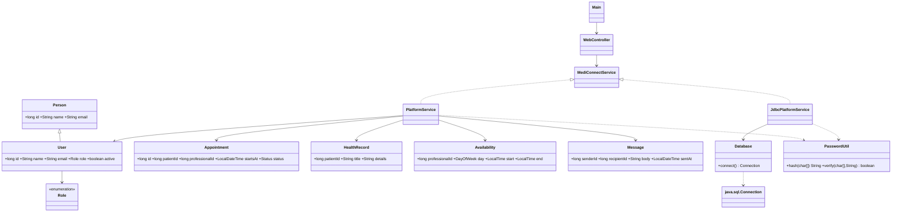

# UML Class Diagram

```mermaid
classDiagram
 class Main
 class WebController
 class MediConnectService
 class PlatformService
 class JdbcPlatformService
 class Person { +long id +String name +String email }
 class User { +long id +String name +String email +Role role +boolean active }
 class Appointment { +long id +long patientId +long professionalId +LocalDateTime startsAt +Status status }
 class HealthRecord { +long patientId +String title +String details }
 class Availability { +long professionalId +DayOfWeek day +LocalTime start +LocalTime end }
 class Message { +long senderId +long recipientId +String body +LocalDateTime sentAt }
 class Database { +connect() Connection }
 class PasswordUtil { +hash(char[]) String +verify(char[],String) boolean }
 class Role { <<enumeration>> }
 Main --> WebController
 WebController --> MediConnectService
 MediConnectService <|.. PlatformService
 MediConnectService <|.. JdbcPlatformService
 Person <|-- User
 PlatformService --> User
 PlatformService --> Appointment
 PlatformService --> HealthRecord
 PlatformService --> Availability
 PlatformService --> Message
 JdbcPlatformService --> Database
 User --> Role
 PlatformService ..> PasswordUtil
 JdbcPlatformService ..> PasswordUtil
 Database ..> java.sql.Connection
```
