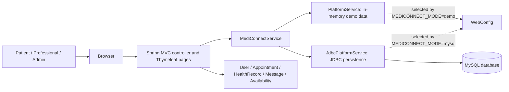

# System Architecture

```mermaid
flowchart LR
 User[Patient / Professional / Admin] --> Browser[Browser]
 Browser --> MVC[Spring MVC controller and Thymeleaf pages]
 MVC --> Contract[MediConnectService]
 Contract --> Demo[PlatformService: in-memory demo data]
 Contract --> Jdbc[JdbcPlatformService: JDBC persistence]
 Jdbc --> MySQL[(MySQL database)]
 Demo -. selected by MEDICONNECT_MODE=demo .-> Config[WebConfig]
 Jdbc -. selected by MEDICONNECT_MODE=mysql .-> Config
 MVC --> Models[User / Appointment / HealthRecord / Message / Availability]
```

The application starts in demo mode unless `MEDICONNECT_MODE=mysql` is set. The mode is selected explicitly at startup; connection errors do not switch to demo data.
